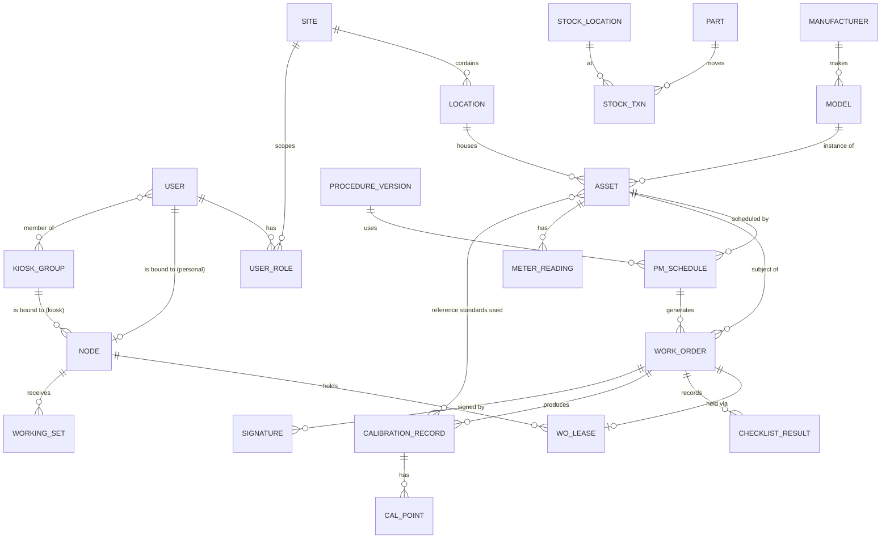
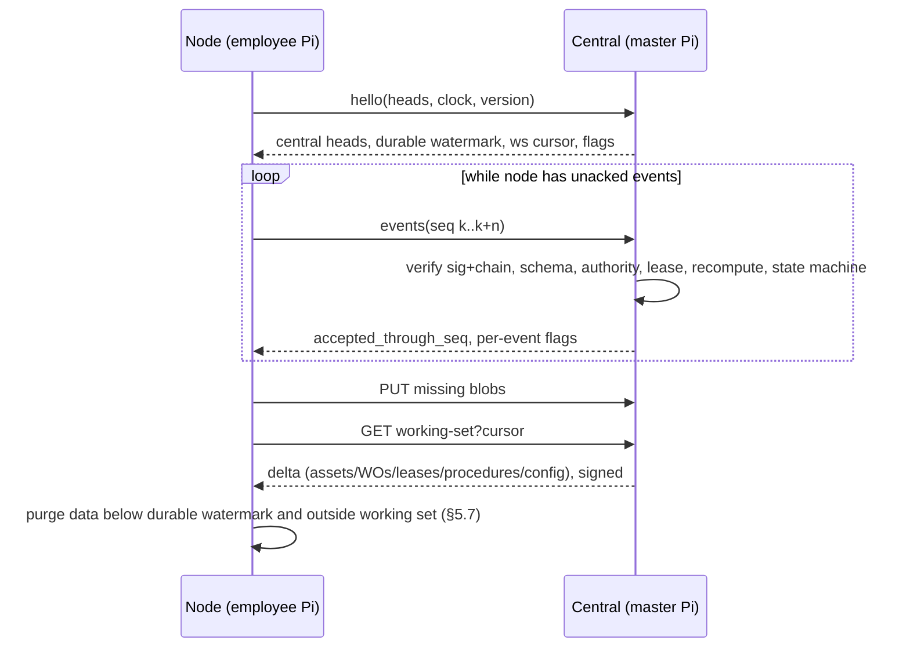

# pi-fleet — Design

Status: **Draft for review (rev 4)** · Last updated: 2026-10-06

pi-fleet is a minimal, open-source (Apache-2.0), offline-first equipment
management system for Raspberry Pi. It covers preventive maintenance (PM),
calibrations, work orders, and spare-parts inventory.

- **Central** (also called the *master Pi*) is the **system of record**. It
  keeps every maintenance, calibration, and equipment record **indefinitely**
  on an attached **1 TB external SSD**.
- **Nodes** are Raspberry Pis that **employees buy themselves**. **Central
  controls network access:** a node can join only by activating with a
  username and password that a super user created on central. Activation
  cryptographically binds that Pi to that user, or to a group of users for a
  kiosk Pi. Each node keeps a
  **31-day working set**: the equipment due for PM or calibration in the
  current window, plus everything the employee recorded recently. The node
  works fully offline within that working set and pushes its records to central
  over **outbound HTTPS**.
- Every active user can **view all sites' data** through central.
- E-signatures follow **21 CFR Part 11** controls (§7).
- **No PHI.**

This document comes before any code. It sets the threat model, the data model,
and the sync design, including conflict handling, append-only audit records,
per-node authentication, signed releases, and backup/restore.

### Decisions recorded (rev 2)

| # | Decision |
|---|---|
| D1 | Implementation language: **Go**. |
| D2 | **Many nodes per site.** Nodes are employee-owned Pis. **Super users create accounts on central. There is no self-service joining.** A node activates with super-user-issued credentials and is bound to that user (one Pi per user), or to a user group in **kiosk mode** (§6.3). |
| D3 | All active users can **read all sites' data**. Write access is role- and assignment-scoped. |
| D4 | Licence: **Apache-2.0**. |
| D5 | Signing with an unverified clock **warns**, does not block. The warning is recorded in the signature. |
| D6 | E-signatures and audit trail target **21 CFR Part 11-style** controls. |
| D7 | Central stores all equipment and maintenance data on a **1 TB external SSD**. Records are kept **indefinitely**. |
| D8 | Nodes keep equipment data for **31 days**, then refresh their working set from central (§5.6). |
| D9 | Off-site backup: **USB disks rotated to another building** (§8.2). |
| D10 | Three roles: **super user**, **mid-tier** (designated by a super user, can reassign work, resolve conflicts, and review), and **user** (§4.3). |
| D11 | Passwords **expire every 31 days** (§6.5). |
| D12 | Working set covers **everything due fleet-wide** in the next 31 days, plus the user's assigned work (§5.6). |
| D13 | A kiosk group member may **also** have one personal Pi. Like every Pi, it must be activated with the user's credentials **and** confirmed by a super user (§6.3). |
| D14 | Mid-tier users are designated **fleet-wide**, covering every site (§4.3). |
| D15 | **Every new Pi (personal or kiosk) needs super-user confirmation** before it becomes active (§6.3). |

---

## 1. Goals and non-goals

### Goals

1. **Central is the system of record.** The authoritative, complete,
   indefinitely retained copy of every record is on central's SSD. Nodes hold
   working copies and records that haven't synced yet.
2. **Offline-first within the working set.** An employee can do all the PM,
   calibration, and work-order tasks in their 31-day working set with no
   network. Browsing outside the working set (other sites, older history) needs
   a connection to central.
3. **Audit-friendly.** Every change is an immutable, attributed, timestamped,
   hash-chained, signed event. You fix a mistake by adding a correction, never
   by editing history.
4. **Part 11-style e-signatures** (§7).
5. **Minimal.** One static Go binary for both roles. SQLite. No broker,
   containers, or external database server.
6. **Outbound-only networking for nodes.** Nodes never accept connections from
   the WAN and work behind home routers and corporate proxies.
7. **No acknowledged record is ever lost.** A node deletes local data only
   after central has the data *and* has it in a verified backup (§5.7).
8. **Open source**, with reproducible, signed releases.

### Non-goals

- **No PHI, ever** (§3.6).
- Not a medical device, and not itself a validated system. The design supports
  Part 11-style controls. Validation and the written SOPs (training,
  accountability, document control) remain the operating organisation's
  responsibility (§7).
- No real-time co-editing. Each record has one writer at a time (§5.4).
- No high-availability central. When central is down, nodes keep working on
  their working sets, and only cross-site browsing and the working-set refresh
  wait.
- No native mobile apps. The UI is a responsive, server-rendered web UI.
- No ERP or purchasing integration in v1. Export is the integration point.

---

## 2. System overview

```
  Employee Pis (nodes) — anywhere: shop floor, site LAN, home network
  ┌────────────────────┐ ┌────────────────────┐ ┌────────────────────┐
  │ node (employee A)  │ │ node (employee B)  │ │ node (employee C)  │
  │ pi-fleet --node    │ │                    │ │                    │
  │ SQLite: 31-day     │ │                    │ │                    │
  │ working set +      │ │                    │ │                    │
  │ unsynced records   │ │                    │ │                    │
  └─────────┬──────────┘ └─────────┬──────────┘ └─────────┬──────────┘
            │   outbound HTTPS only (proxy / NAT friendly)  │
            └──────────────────────┬────────────────────────┘
                                   ▼
             ┌──────────────────────────────────────────┐
             │ central = master Pi (pi-fleet --central)  │
             │  SD/boot: OS, binary, config, keys       │
             │  ┌────────────────────────────────────┐  │
             │  │ 1 TB external SSD  /srv/pi-fleet   │  │
             │  │  all events, projections, blobs    │  │      ┌───────────────┐
             │  │  retained indefinitely             │──┼─────▶│ backup disk + │
             │  └────────────────────────────────────┘  │      │ off-site copy │
             │  Web UI: super users, mid-tier, fleet    │      └───────────────┘
             └──────────────────────────────────────────┘
```

### 2.1 Software

- **One binary, two roles:** `pi-fleet serve --role=node|central`. Same event
  format, verification code, and projection code on both sides.
- **Go** (pinned toolchain), static `linux/arm64` build with `CGO_ENABLED=0`.
  - Database: `modernc.org/sqlite` (pure Go SQLite), WAL mode.
  - Web: `net/http` and `html/template` (auto-escaping), with minimal
    progressive-enhancement JS and no SPA framework.
  - Crypto: `crypto/ed25519`, `crypto/sha256`, `golang.org/x/crypto/argon2`.
  - Releases: minisign verification (`aead.dev/minisign`).
  - Dependencies are kept to a short, vendored list.
- Central's SQLite database runs with a single writer goroutine that serialises
  ingest. That is ample for the expected scale (hundreds of nodes,
  about 1M events/year).

### 2.2 Hardware

| | Central (master Pi) | Node (employee Pi) |
|---|---|---|
| Board | Pi 5, 8 GB recommended (Pi 4, 4 GB minimum) | Pi 4 (2 GB+) or Pi 5. 64-bit Raspberry Pi OS Lite or Desktop. |
| Boot media | SD or NVMe: OS, binary, config, keys only | SD (32 GB+) or SSD |
| Data media | **1 TB external SSD** (USB 3 or NVMe HAT) holding all data | Boot media |
| Clock | RTC battery **required** (Pi 5) + NTP | RTC battery strongly recommended (Pi 5). Affects clock-trust warnings (§3.4). |
| Backup | Second disk (≥ 1 TB) **plus 2–3 rotated off-site USB disks (≥ 1 TB)**, required (§8) | None required. Central is the backup (§8.4). |
| Power | Official PSU. Powered USB hub or NVMe HAT for the SSD (bus-powered SSDs brown out on Pi USB). UPS recommended. | Official PSU |

The release notes publish a list of supported boards. A node's
`hello` reports its board and OS, and central can refuse unsupported versions.

### 2.3 Central storage layout

The SSD is mounted by filesystem UUID at `/srv/pi-fleet` (ext4,
`noatime`). The service unit has `RequiresMountsFor=/srv/pi-fleet`. **If the
SSD is missing, central refuses to start rather than silently writing to the
SD card.**

```
/srv/pi-fleet/
  db/central.db           SQLite (WAL): events, receipts, projections, users
  blobs/ab/cd/<sha256>    attachments (content-addressed, immutable)
  backup-staging/         snapshot staging before copy to backup disk
  exports/                archival exports (§8.3)
/etc/pi-fleet/            config (SD)
/etc/pi-fleet/keys/       central signing keys, fleet CA intermediate (SD, 0600; escrowed §6.2)
/opt/pi-fleet/releases/   binaries (A/B, §9)
```

Keys are kept on the boot media and off the data disk, so a stolen or
discarded SSD doesn't carry signing keys. Keys are escrowed separately (§8.2).

**Capacity:** about 1.5 KB per event × about 1M events/year ≈ 1.5 GB/year of
records. Attachments dominate: 10 MiB cap per file, about 1 MB average, so
roughly 10–20 GB/year at a few hundred uploads a week. 1 TB lasts decades at that rate.
Central alerts at 70 % and 85 % SSD usage and at any SMART warning. At 95 %
it refuses new attachments, but it always keeps accepting events.

---

## 3. Threat model

### 3.1 What we protect

| Asset | Why it matters | Priority |
|---|---|---|
| **Integrity of maintenance and calibration records** | Safety and regulatory evidence. A falsified "calibration passed" can hurt people. | **Highest** |
| **Durability of central's SSD data** | It is the only complete copy of an indefinitely retained record set. | **Highest** |
| Attribution and e-signatures | Part 11: signatures must be unique, verifiable, and bound to records. | High |
| Node availability (working set) | Techs must work without a network. | High |
| Central keys, fleet CA, release key | Whoever holds them can inject records or code. | High / **Highest** (release key) |
| Equipment inventory confidentiality | Model/serial/firmware/location data helps attackers target devices. Not PHI. | Medium |
| Staff PII (names, emails, usernames) | Limited PII. Minimise it. | Medium |

### 3.2 Actors and trust boundaries

| Actor | Trust | Notes |
|---|---|---|
| Employee (user; node owner) | Trusted **as a user only** | **Owns the hardware and has root on it.** We can't trust the node's software to be unmodified. The node's signature proves "this activated device, bound to this user (or kiosk group)", not "untampered code". |
| Mid-tier user | Trusted to reassign work, resolve conflicts, and review at **every site** (D14) | Their actions are audited events. |
| Super user | Trusted to create accounts, designate mid-tier users, control node access, and manage catalog and config | Can't forge employee events, which carry node signatures. Super-user actions are themselves audited events. |
| Anyone with a Pi but no account | **Untrusted** | Can't join. Activation requires super-user-issued credentials (§6.3). |
| Release maintainers | Trusted for code | The release key is offline and separate from every runtime key. |
| Networks (home Wi-Fi, site LAN, WAN, proxies) | **Untrusted** | May do TLS interception. |
| Physical access to node | **Untrusted** | Employee devices are taken home, lost, or sold. |
| Physical access to central | Trusted location assumed (locked room) | The SSD is the crown jewel. |

Trust boundaries: (1) browser ↔ node UI, (2) browser ↔ central UI,
(3) node ↔ central sync API, (4) release publisher ↔ installed binary,
(5) node process ↔ node storage, (6) central ↔ SSD and backup targets.

### 3.3 STRIDE analysis

| # | Threat | Boundary | Mitigation |
|---|---|---|---|
| S1 | Unauthorised device poses as a node | 3 | No self-service join. A node can activate only with a super-user-created account that is in `pending_activation`. The credentials are one-time and expire after 72 h, and the resulting binding stays inactive until a **super user confirms it** by matching pairing words (§6.3, D15). Every request is then signed with the node's transport key (RFC 9421), and every event with its event key. Revocation is checked on every request. |
| S1b | Someone steals or intercepts activation credentials and binds their own Pi first | 3 | The activation password is temporary and single-use, and it must be replaced during activation. The password never crosses the wire: activation uses a challenge-response proof, so even a TLS-intercepting proxy can't replay it (§6.3). **Every binding needs super-user confirmation** (D15). The super user checks the pairing words with the real employee (in person or by phone) before confirming, so an attacker's Pi shows different words and is rejected. If the real user then finds their account "already bound", they report it, and the super user revokes the binding, which surfaces the theft. |
| S2 | Attacker poses as central (fake config, working set, updates) | 3,4 | The node pins the fleet root at activation (authenticated by the activation proof, §6.3). Central-authored data is signed by the central key. Releases are verified against keys **compiled into the binary** (§9). |
| S3 | One employee impersonates another | 1,2,3 | Each node is **bound to one user** (or to a kiosk group). Central rejects node events whose `actor_user_id` isn't the bound user or a current member of the kiosk group. Every signing requires the password (§7). User ids are never reused. |
| T1 | A user edits or deletes past records | 5 | The event log is append-only (SQLite triggers + hash chain). Corrections are `*.amended` / `*.voided` events with mandatory reasons. |
| T2 | Employee modifies node software or DB (they have root) to forge results | 5 | **Central doesn't trust node-side computation.** It re-validates every event: schema, state machine, required steps, and it **recomputes calibration pass/fail from raw points and tolerances**. Mismatches are flagged and sent to review. Forgery is limited to the employee's own identity (S3). Once acked, history can't be rewritten without a detected fork (§5.8). |
| T3 | Backdating via the system clock | 5 | Order comes from the chain position, not wall time. Events carry wall time + HLC, and central records `received_at` as corroborating time. Skew is flagged. Signing with an unverified clock **warns** and is recorded in the signature (D5, §3.4). |
| T4 | MITM / TLS-intercepting proxy alters sync | 3 | End-to-end application-layer signatures on requests and events. |
| T5 | Malicious update | 4 | Signed releases, embedded keys, anti-rollback, A/B install with health check (§9). |
| T6 | Central SSD silently corrupts data | 6 | Hash chains, nightly `verify`, SQLite `integrity_check`, SMART monitoring, verified backups (§8). |
| R1 | User denies signing | 1,2 | Part 11 signature events: user id + password re-entry, printed name, meaning, time, and a hash of the signed content (§7). |
| I1 | Lost, stolen, or sold employee Pi exposes data | 5 | No PHI. Local data is limited to the 31-day working set, which is **fleet-wide** (D12): every Pi holds the whole fleet's due list. That fits D3 (everyone can read everything), but a lost Pi exposes more. Revocation stops sync and triggers a local wipe on next contact (best effort). Full-disk encryption (LUKS, passphrase at boot) is strongly recommended. Nodes report their encryption status in `hello`, and fleet policy can require it, but **this is self-reported** because the device is employee-controlled. |
| I2 | An active user bulk-downloads the whole fleet's data | 2,3 | Cross-site read access is allowed (D3). Fleet reads are rate-limited, bulk exports are limited to mid-tier and super users, and exports are logged as events. Accepted risk: data is not PHI. |
| I3 | Theft or disposal of central's SSD or backup disks | 6 | Central room is physically secured. Backups are encrypted (age). The SSD can optionally use LUKS with a keyfile on the boot media, or Clevis/Tang. Retired disks are destroyed or securely erased (§8.5). |
| I4 | LAN eavesdropping on UI sessions | 1,2 | HTTPS everywhere. Node UI uses a fleet-CA cert or listens on localhost only. Central uses Let's Encrypt or org PKI. |
| D1 | Central down | 3 | Nodes keep working within their working set. Backoff with jitter. |
| D2 | Malicious or broken node floods central | 3 | Per-node rate limits, batch caps, attachment quotas. Revocation. |
| D3 | Activation brute-force | 3 | The activate endpoint is rate-limited per IP and per username. 5 failed proofs lock the pending account and alert super users. Usernames that don't exist or aren't pending return the same response as a wrong password. |
| D4 | Central SSD fills or fails | 6 | Capacity alerts. Events are never refused for space, though attachments are. Backups and restore runbook (§8). |
| E1 | Web vulnerability leads to admin actions | 1,2 | Auto-escaping templates, CSRF tokens, parameterised SQL, strict CSP, systemd sandboxing, unprivileged service user. |
| E2 | User escalates to roles at other sites | 2,3 | Roles are site-scoped and held on central. Central authorises every write event against the actor's roles *at the time of the event* (§5.3). |

### 3.4 Clock trust

- Ordering within a chain is `(chain_id, seq)`. Wall time never decides order.
- Each event stores `wall_time` (UTC) and an HLC. Central stores `received_at`.
  Reports display both.
- Each node tracks a **clock state**: `verified` (NTP synchronised, or
  central-checked within the last 24 h with |skew| < 2 min, or RTC with
  battery and a prior verification), or otherwise `unverified`.
- **Signing with an unverified clock shows a warning and proceeds (D5).** The
  signature payload records `clock_state=unverified` and the last known skew.
  Central flags these signatures for mid-tier review and shows them in
  reports.
- Central flags events whose wall time conflicts with chain neighbours or with
  `received_at`. Flags are kept, never used to drop events.

### 3.5 Out of scope / accepted risks

- A node owner with root can fabricate events **under their own identity**
  before sync. We reduce this (central re-validation, review sign-offs) and
  detect what we can, but we can't prevent it on hardware we don't control.
- Remote wipe of an employee Pi is best effort. A device that never reconnects
  keeps up to 31 days of cached data.
- No TPM or secure element is assumed.
- Compromise of the offline release key is handled procedurally (§9.4).
- Side channels and nation-state adversaries.

### 3.6 No-PHI guardrails

- The schema has **no** patient, encounter, or clinical fields. Equipment links
  to *locations*, never to people receiving care.
- Free text is the leak path. Mitigations:
  - A persistent "Do not enter patient information" notice.
  - A configurable PHI-pattern linter (MRN-like numbers, DOB patterns, etc.)
    that warns or, by policy, blocks.
  - **Audit-preserving redaction.** Event hashes cover `payload_hash`, not the
    payload bytes, so a supervisor can issue `payload.redacted`. The payload is
    then removed on central and on any node holding it, while the chain still
    verifies. The redaction itself is audited.
- Attachments: JPEG/PNG/PDF only (checked by content, not file name). On
  upload, JPEG EXIF/XMP/comments and PNG text/EXIF/time chunks are stripped.
  A file showing patient information is **purged** by a mid-tier user and
  deleted everywhere (§5.10).

---

## 4. Data model

### 4.1 Principles

- **Event-sourced.** The append-only `events` table is the source of truth.
  Other tables are **projections**, rebuildable with `pi-fleet rebuild`.
- **UUIDv7 ids**, generated offline. Human-facing numbers carry a site code
  and a node short-code so they're unique without coordination:
  `NYC-WO-7K2-00123` (site `NYC`, node `7K2`). Assets get fleet-unique tags
  assigned by central (`NYC-A-00042`). An asset registered offline gets a
  provisional tag until central confirms.
- **Ledgers, not balances.** Stock, meter readings, and labor are additive
  entries.
- **Versioned, immutable reference data.** Procedures, templates, and
  tolerances are versioned. Records cite the version used.
- **Users are never deleted or re-assigned.** They are disabled. User ids
  are permanent (Part 11 §11.100(a)).
- **Write authority** is explicit for every mutable entity (§5.4).

### 4.2 Event envelope

| Field | Type | Notes |
|---|---|---|
| `event_id` | UUIDv7 | Globally unique |
| `node_id` | UUIDv7 | Author node (central has its own node id) |
| `chain_id` | UUIDv7 | Node's current chain. A new chain is started after any node restore (§8.4). |
| `seq` | int64 | 1-based and gap-free within the chain |
| `prev_hash` | 32 B | Hash of the previous event in the chain. All zeroes for seq 1. A new chain's `chain.started` payload names its parent chain's last `(chain_id, seq, hash)`, which the genesis hash covers through `payload_hash`. |
| `hlc` | int64 | Hybrid logical clock |
| `wall_time` | RFC 3339 UTC | Device clock |
| `clock_state` | enum | `verified` / `unverified` at creation |
| `actor_user_id` | UUIDv7 | Authenticated user, or a `system:*` actor |
| `actor_session_id` | UUIDv7 | Login session |
| `type` | text | e.g. `calibration.recorded` (§4.4) |
| `entity_type`, `entity_id` | text, UUIDv7 | |
| `base_version` | int64 | Entity version the author saw (§5.4) |
| `lease_id` | UUIDv7? | Work-order lease under which the write was made (§5.4) |
| `schema_version` | int | Payload schema version |
| `payload` | canonical JSON (RFC 8785, **integers only**) | NULL after redaction. Numbers must be integers within ±(2^53−1). Measurements and other decimals are carried as **strings** (`"10.020"`), so no floating-point rounding ever touches a result and significant figures are preserved. |
| `payload_hash` | 32 B | SHA-256 of the canonical payload |
| `hash` | 32 B | SHA-256 of the domain tag `pi-fleet/event/v1\0` followed by the canonical JSON of all fields above except `payload`, plus `key_id`. Byte fields are hex. `hlc` is a decimal string because it exceeds 2^53. |
| `sig` | 64 B | Ed25519 signature over `hash` by the node's event key |
| `key_id` | text | Which node key (rotation) |

On central, `event_receipts` records `received_at`, `source_ip`, `flags`
(`clock_skew`, `clock_unverified`, `non_authorized`, `stale_base`,
`recompute_mismatch`, `fork`), `projection_status`, and the result of
re-validation.

**Append-only enforcement:** `BEFORE UPDATE` and `BEFORE DELETE` triggers on
`events` raise errors. There are two narrowly scoped exceptions, each with its
own code path and guard:

1. **Redaction.** Clears `payload` only, and requires a matching
   `payload.redacted` event.
2. **Node retention purge** (nodes only, never central). Deletes events below
   the durable watermark (§5.7) and keeps a signed chain checkpoint.

### 4.3 Entities (projections)

Write authority column: **C** = central-managed (changed by authorised users'
events, serialised by central). **A** = author-owned (immutable once recorded,
corrections by amendment). **L** = writable only by the holder of a lease
granted by central. **Ledger** = additive.



| Entity | Authority | Key fields | Notes |
|---|---|---|---|
| `site` | C | id, code, name, timezone | |
| `user` | C | id (permanent), username (unique, never reused), legal_name (for signature manifestation), email, home site(s), status (`pending_activation`/`active`/`locked`/`disabled`), created_by, identity_verified_by, identity_verified_at, password_salt, password_verifier, password_changed_at, password_expires_at, verifier history (last 5) | Created **only by a super user**. The verifier is Argon2id(password, per-user salt). Central never receives plaintext passwords from nodes (§6.5). Verifiers are cached only on the node(s) the user may log in to (their bound node, or kiosks they belong to). |
| `user.role` | C | one role per user, fleet-wide (a column on `user`, changed by `user.role_changed`) | Three roles (D10). **`user`** performs assigned work, records results, opens corrective WOs, and signs `performed`. **`mid_tier`** is designated by a super user and always applies **fleet-wide** (scope `*`, D14). It does everything a `user` can, plus **assign/reassign WOs, resolve conflicts, review signatures, and bulk export**. **`super_user`** creates and disables accounts, designates mid-tier users, activates kiosks, revokes nodes, manages catalog, procedures, schedules, config, and releases. **Every active user can read all sites (D3).** |
| `node` | C | id, mode (`personal`/`kiosk`), bound_user_id (personal) or kiosk_group_id (kiosk), site_id (kiosk), short_code, public keys, status (`pending_confirmation`/`active`/`rejected`/`revoked`), activated_at, confirmed_by, confirmed_at, board/OS/version, encryption self-report, last_seen | **At most one active personal node per user.** |
| `kiosk_group` | C | id, site_id, name, member user ids | Managed by super users. Membership changes reach the kiosk through its working set (§6.3). |
| `location` | C | id, site_id, parent_id, name, kind | Tree |
| `manufacturer`, `model` | C | | Shared catalog |
| `asset` | C | id, tag (the physical asset tag, unique fleet-wide; a duplicate is a conflict), manufacturer and model (text in v1; a shared `model` catalog comes later), serial, location_id (implies site), status (`in_service`, `out_of_service`, `retired`, `missing`), risk_class, is_reference_standard, custom fields (schema-checked JSON) | Field edits from nodes are merged by central (§5.4). Moving an asset to another site is a relocation. No two-phase transfer is needed because central holds authority. |
| `procedure_version` | C | title, steps[] (check / numeric-with-limits / text / photo), published_at | Immutable once published |
| `pm_schedule` | C | asset_id, wo_type (pm / calibration / inspection), procedure, interval_days, grace_days, next_due (projection), open_wo_id | Central's `system:scheduler` opens a WO for each schedule due within 31 days that has none outstanding. Completing it sets next_due = completion date (site time zone) + interval; cancelling it lets the scheduler regenerate. Meter-based triggers come later. |
| `work_order` | C to create/assign, **L** to perform | id, number, type (`pm`, `corrective`, `calibration`, `inspection`, `install`, `retire`), asset_id, priority, status, problem, findings, resolution, due_at, assigned_to | §4.5 |
| `wo_lease` | C | wo_id, node_id, user_id, granted_at, ended_at, end_reason | One active lease per WO (§5.4) |
| `checklist_result` | A (under lease) | wo_id, step_id, value, pass/fail, recorded_by | |
| `calibration_record` | A (under lease) | wo_id, asset_id, procedure_version_id, environmental conditions, as_found / as_left result, adjusted, overall pass/fail, standards_used[] (asset id, its cal record id, due date at time of use), certificate attachment | Using an out-of-date standard → warning/block per policy. **Central recomputes pass/fail.** |
| `cal_point` | A | parameter, unit, nominal, tolerance (abs / % / limits), as_found, as_left, uncertainty?, pass/fail (computed and stored) | |
| `signature` | A | §7.3 | |
| `labor_entry`, `meter_reading` | Ledger | | |
| `part` | C | part_no, description, unit, compatible models | |
| `stock_location` | C (shared stockrooms) / A (an employee's personal van or kit, owned by their node) | | |
| `stock_txn` | Ledger | part_id, stock_location_id, delta, kind (`receive`, `issue`, `return`, `adjust`, `transfer_out`, `transfer_in`, `count`), wo_id?, reason | A `count` stores observed and computed quantities. **Counts on shared locations require an online connection** (§5.4). |
| `attachment` | A | sha256, mime, size, filename, linked entity | Blob on central's SSD. Nodes cache them per the working-set rules. |
| `working_set` | (central-derived) | node_id, window_start, window_end, asset ids, WO ids, cursor | §5.6 |
| `conflict` | (central-derived) | event_id, kind, status, resolution_event_id | §5.5 |

Each projection row has `version` and `last_event_id` so it traces back to its
history.

### 4.4 Event types (initial set)

- `asset.registered`, `asset.updated`, `asset.relocated`,
  `asset.status_changed`, `asset.retired`, `asset.merged`
- `workorder.opened`, `workorder.assigned`, `workorder.claimed`,
  `workorder.lease_granted`,
  `workorder.lease_ended`, `workorder.status_changed`,
  `workorder.step_recorded`, `workorder.amended`, `workorder.voided`
- `calibration.recorded`, `calibration.voided` (a correction is a void with a reason plus a new record; at most one valid record per WO)
- `signature.applied`, `signature.withdrawn` (withdrawal is a new event, and
  the original stays visible)
- `pm_schedule.created`, `pm_schedule.changed`, `pm_schedule.ended`
- `procedure.published`, `procedure.retired`
- `part.created`, `stock_location.created`, `stock.txn_recorded`, `stock.txn_reversed`, `meter.read`, `labor.logged`,
  `labor.reversed`
- `attachment.added`, `attachment.detached`
- `user.created`, `user.role_changed`,
  `user.password_changed` (new salt-bound verifier only, never plaintext),
  `user.locked` (authored by `system:auth` on any node), `user.unlocked`,
  `user.password_reset` (by super user), `user.password_expired`,
  `user.locked`, `user.unlocked`, `user.disabled`
- `kiosk_group.created`, `kiosk_group.member_added`,
  `kiosk_group.member_removed`
- `node.activated`, `node.activation_failed`, `node.confirmed`,
  `node.rejected`, `node.revoked`,
  `node.key_rotated`, `node.wipe_confirmed`
- `catalog.*`, `config.*`
- `payload.redacted`, `conflict.resolved`, `chain.started`,
  `chain.checkpoint`, `system.backup_verified`, `system.offsite_written`,
  `system.offsite_confirmed`, `system.export_completed`,
  `system.bulk_read`

Corrections are always new events with a mandatory `reason` and a link to the
corrected event. Audit views show the original, struck through, alongside the
correction.

### 4.5 Work order lifecycle

```
 open ──► assigned ──► in_progress ──► completed ──► reviewed ──► closed
   │         │             │  ▲            │
   │         │             ▼  │            └── reopened (reason) ──► in_progress
   └─────────┴──────► on_hold ┘
   any state before closed ──► cancelled (reason)
```

- `assigned` grants a lease to the assignee's node (§5.4).
- `completed` requires all mandatory steps, plus a calibration record for
  calibration WOs, plus a `performed` signature.
- `reviewed` requires a `reviewed` signature from a **different user** with the
  `mid_tier` role (two-person rule; a super user may relax it per site for
  low-risk classes).
- `closed` is terminal. A later amendment re-opens the review requirement and
  marks earlier signatures as **stale** (§7.2).
- **Central enforces the state machine** on ingest. Nodes enforce it too for
  user experience, but central doesn't trust them (T2).

---

## 5. Sync design

### 5.1 Model

- **Upstream (node → central):** each node has an append-only, hash-chained,
  signed log. Sync copies it to central. **Central is the serialisation point
  and system of record.**
- **Downstream (central → node):** central sends each node its **working set**
  (§5.6) as a **signed state snapshot**: projection rows, not events, so a
  node never needs anyone else's history to rebuild its view. The snapshot
  carries leases, the node's own record, and central's flags on the node's
  events (conflict outcomes). The node **rebases**: it replaces its
  projections with the snapshot, then re-applies its own events that the
  snapshot doesn't yet reflect (`acked_seq`). Any that no longer fit are
  flagged locally exactly as central will flag them.
- A node's database therefore holds **only its own events** plus the latest
  snapshot. Central holds every chain.
- **On demand (node → central, online only):** fleet-wide reads of other sites
  and older history (§5.9).
- All connections are node-initiated HTTPS. Central never connects to a node.
- Upstream sync is **idempotent and resumable**, keyed by `(chain_id, seq)`.

### 5.2 Protocol

Prefix `/v1`. Every request carries an RFC 9421 HTTP Message Signature made
with the node's transport key, covering method, path, `content-digest`,
`date`, and a nonce. There is a 5-minute window and nonce replay protection.
This works through TLS-intercepting proxies.

| Endpoint | Purpose |
|---|---|
| `POST /v1/activate/challenge` | Unauthenticated, rate-limited. Username → salt, Argon2 parameters, and a single-use server nonce (same shape for unknown usernames). |
| `POST /v1/activate` | Username + password proof + node id (generated by the node at `init`; central checks it's an unused UUIDv7) + node public keys + encrypted new-password verifier → `pending_confirmation`, pairing words, and central's node id and event key, MAC'd with the one-time-password key (§6.3). |
| `GET /v1/activate/status` | Signed with the node's transport key. The node polls until a super user confirms or rejects it. On confirmation it gets its LAN TLS cert and can start syncing. |
| `POST /v1/sync/hello` | Node: version, chain heads, clock, board/OS, encryption self-report. Central: server time, its heads for this node's chains, **durable watermark** per chain (§5.7), working-set cursor, min supported version, revocation/wipe flag, missing-blob list. |
| `POST /v1/sync/events` | Upload ≤ 500 events / ≤ 1 MiB (zstd), contiguous. Response: `accepted_through_seq` and per-event flags. |
| `GET /v1/sync/snapshot?chain=` | The node's working set (§5.6) as JSON, with central's Ed25519 signature over the exact bytes in `X-PiFleet-Snapshot-Signature`. Pulled after any push, or when `hello` reports a new `state_version`. *v1 sends full snapshots; deltas are a later optimisation.* |
| *Later:* `HEAD/PUT/GET /v1/blobs/{sha256}` | Attachment upload/download, resumable. |
| `GET /v1/fleet/assets?q=`, `GET /v1/fleet/assets/{id}` | Live, read-only search and full history across all sites (§5.9). Signed by an active Pi's transport key, 120 requests/minute per Pi. |
| `POST /v1/fleet/stock/count` | Shared stockroom count made on a Pi, recorded on central at once and attributed to the Pi's bound user (§5.4). |
| *Later:* `GET /v1/releases/manifest` | Signed release manifest mirror (§9). |

**Clock fallback.** A Pi whose clock is outside the 5-minute signature
window (no RTC battery, no NTP) would otherwise never sync, and syncing is
how it learns its clock is wrong. When central refuses a signature's time,
the client re-signs using the offset from central's `Date` header. Only
transport signing uses the offset; events keep the local clock and stay
`clock_state = unverified` until the clock is genuinely right (§3.4).

**Fork handling.** A different event at a position central already holds
puts the node in **quarantine**: pushes are refused, `hello` reports it,
and a super user must investigate. Both versions stay stored.

**Node sync loop.** It runs every 5 min ±30 % jitter when online, immediately
after any signature, and on demand.



Backoff runs from 30 s to 30 min with jitter. The UI always shows "last synced",
the unsynced event count, the working-set window, and the clock state. Warnings
appear at 24 h unsynced, and at 7 days mid-tier users are alerted on central.

### 5.3 Central ingest validation (per event, in order)

1. The node is active, the key is valid for this point in the chain, and
   `actor_user_id` is the node's bound user, or a member of its kiosk group at that time (or a `system:*` actor permitted
   for nodes).
2. The signature is valid over the recomputed `hash`, and `payload_hash`
   matches.
3. Chain continuity: `seq` = last + 1 and `prev_hash` matches. A gap rejects
   the rest of the batch. A different event at an existing seq means **fork**
   (§5.8).
4. The schema validates for `(type, schema_version)`. An unknown newer schema
   is stored as `projection_status=deferred`, never dropped.
5. **Authority:**
   - The actor held the needed role at the site, as of the event's chain
     position and central's record of role grants.
   - For `L` entities, `lease_id` was the active lease for that WO when
     central received the event, or was ended after the event's HLC (offline
     grace, §5.4).
6. **Business re-validation:** state machine transitions, required steps, the
   two-person rule, and **recomputed calibration pass/fail**. A mismatch raises
   `recompute_mismatch`, and the central-computed value is shown beside the
   node's.
7. Clock plausibility gets a flag only.

**Rule: a validly signed, in-sequence event is never discarded.** If it fails
steps 5–6, it is stored and flagged, excluded from projections (or projected
with a warning, for `recompute_mismatch`), and put in the conflict/review
queue. Bad signatures and chain breaks are rejected and logged as security
events.

### 5.4 Write authority and conflict avoidance

With many employee nodes per site, editing the same thing offline is
realistic. Instead of auto-merging (CRDTs/LWW), which hides history, every kind
of data has an explicit write rule:

| Data | Rule | Conflict possible? |
|---|---|---|
| New author-owned records (corrective WO opened in the field, cal record, checklist result, signature, meter reading, labor, attachment) | Created offline freely and immutable once recorded. The author's node is the only writer, and corrections are amendments. | No |
| **Performing a work order** | **Lease.** Assigning a WO grants a lease to the assignee's node, which arrives with the working set. Only the lease holder may record steps, results, or status changes up to `completed`. | Only on reassignment (below) |
| Reassigning a WO (mid-tier or super user only) while the current holder is offline | Central ends the old lease and grants a new one. The supervisor is warned: "holder last synced 3 days ago, they may have done work." Events from the old holder whose HLC predates the lease end (or that were created before the old node next contacted central) are accepted under **offline grace**. Events after that point are flagged `non_authorized` and go to the conflict queue. | Yes → human |
| **Picking up unassigned due work offline** (any site, D12) | The user **claims** the WO on their node (`workorder.claimed`), which creates a provisional lease, and work can start right away. Central grants the real lease to the **first claim it receives**. A later claimant's recorded work is kept, never dropped, but flagged `duplicate_work` and sent to the conflict queue. A mid-tier user then either keeps it as an additional record (e.g. a second inspection) or voids it with a reason. To reduce duplicates, the UI shows "claimed by X as of last sync" and says when the node is offline. | Yes → human (only if two people claim the same job offline) |
| Review signatures, approvals | Not lease-gated. They are separate events bound to a **content hash** of the WO at signing time. If the WO changes afterwards, the signature is shown as **stale** and review is required again. | No (staleness is visible) |
| Asset master data (location, status, custom fields) edited from nodes | Event carries `base_version` + changed fields. Central applies it if none of those fields changed since `base_version`. Otherwise it flags `stale_base` and queues it. **Safety rule:** for a status conflict, the most restrictive status (`out_of_service` > `missing` > `in_service`) is applied immediately, and the conflict is still queued for review. | Yes → human (overlapping fields only) |
| Catalog, procedures, schedules, sites, users | Edited online on central only, and versioned. | No |
| Shared stockroom issues/receipts | Ledger, additive and commutative. | No |
| Shared stockroom **counts** | **Online only** (`/v1/fleet/stock/count`), so central computes the adjustment against its own complete ledger at one serialisation point. | No |
| Personal stock locations (employee van/kit) | Owned by the employee's node, so counts work offline. | No |
| Same device registered twice (provisional tags from two nodes) | Central flags duplicates (manufacturer + model + serial). A mid-tier user resolves with `asset.merged`. Both histories are preserved. | Yes → human |
| Fork (same `(chain_id, seq)`, different hash) | Security incident (§5.8). | Yes → incident |

### 5.5 Conflict queue

- Each flagged event appears in the **review queue** (web interface), showing
  the event, the flag and its detail, who/when, and whether it was applied with
  a warning or left out.
- **Mid-tier users** (or super users) record a decision with
  `conflict.resolved`: *acknowledged*, *accepted* or *rejected*, with a
  mandatory note. The decision records a human judgement. It does **not**
  re-apply, merge or remove anything automatically. Any fix (for example
  re-recording work that was rejected) is an ordinary correction with its own
  audit trail. Automatic re-emission and merging were considered and left out:
  they would act on someone else's behalf without their signature.
- Decisions are signed and audited, and appear in the record's audit trail and
  exports. The original flagged event stays in the log forever.
- The affected node receives the decision in its working set.

### 5.6 Working set (31-day window)

A node holds only what its employee needs for the current window. Its contents:

1. **Assigned work:** every WO assigned to the bound user (for a kiosk, to any
   member of its group), with its lease, at any site.
2. **Due-soon equipment at every site (D12),** for personal Pis and kiosks
   alike. Assets with PM or calibration due
   (or overdue) in the window from **now to now + 31 days**. This includes
   the asset record, location, schedule, procedure version(s), required
   reference standards with their due dates, and a compact history (the last 3
   completed PM/cal records per asset, results only, attachments on demand).
   Also **all non-retired equipment at the user's home sites**, so a
   breakdown can be logged offline against equipment that isn't due for
   anything.

   **Size estimate:** for a fleet of 20,000 assets with roughly one in six
   due in any 31-day window, that's about 3,500 assets × ~5 KB ≈ 20 MB, plus
   procedures. Attachments are fetched on demand only. The first full pull is
   the largest. After that, deltas are small.
3. **Reference data:** catalog subset, parts for the involved models, the
   user's personal stock locations, sites/locations tree, config, PHI-lint
   patterns.
4. **The employee's own recent records:** everything authored on this node in
   the last 31 days.
5. **Login data:** password verifiers and expiry state for the bound user, or
   for every current kiosk group member. A member removed from a kiosk group
   has their verifier deleted from that kiosk at the next sync.

**Refresh:**

- **Incremental:** every sync pulls the delta since the node's cursor (new
  assignments, schedule changes, lease changes, conflict outcomes).
- **Monthly rebaseline:** on the first sync on or after each calendar month
  start (and on activation), central recomputes the full working set for the
  next 31 days. The node replaces its window and then purges per §5.7. This is
  "the node queries the master Pi for that month's devices due for PM and
  calibration."
- If a node can't reach central, it **keeps everything** past 31 days. It never
  purges without a durable watermark, and it warns the user that the working
  set is stale and new work won't appear.

**Offline coverage:** within the working set, everything works offline.
Anything outside it (other sites, older history, unassigned assets) is
available online through the fleet view (§5.9). Corrective WOs can be opened
offline against any asset already in the working set, or against a
provisionally registered asset.

### 5.7 Node retention and purge

A node deletes a local item only when **all** of these hold:

1. It is older than **31 days** (by creation, or by last activity for a WO),
   **and**
2. All events that created or touched it are at or below the chain's **durable
   watermark**, meaning central has accepted them **and** included them in a
   **verified backup** (§8.2). This is stronger than just "acked". **and**
3. It isn't in the current working set, it isn't covered by an active lease or
   an open WO, and it isn't referenced by an open conflict.

When the node purges events, it writes a `chain.checkpoint` (last purged
`seq` + `hash`, signed) so the chain continues and verifies from that point.
Attachments are dropped from the local cache under the same rule.

Result: an employee Pi normally holds around 31 days of data. If the master Pi's
SSD died, every record not yet in central's backups would still exist on
a node and would be re-pushed (§8.4).

### 5.8 Fork and tamper detection

- On `hello`, central compares its head for each chain with the node's. A
  mismatching hash at the same `seq` is a **fork**. Both branches are stored,
  the node is **quarantined** (it can still work offline but uploads are
  paused), and super users are alerted.
- `pi-fleet verify` re-walks chains (from checkpoints on nodes, from genesis on
  central), signatures, the recompute checks, and projection rebuild == live.
  It runs nightly on central and weekly on nodes, and the result is recorded as
  an event.
- Optional: central publishes a daily signed digest of all chain heads for
  external anchoring (printed, emailed, or kept in a separate system).

### 5.9 Fleet view (cross-site reads, online)

- Any active user can browse all sites' assets, history, WOs, calibration
  certificates, and reports (D3). The node UI proxies these queries to central
  using the node signature and the user's session, or the user can use
  central's web UI directly.
- Fleet-view results are cached on the node for 24 h at most and are never
  part of the persisted working set, so the 31-day footprint stays bounded.
- Reads are rate-limited. Bulk export (CSV/JSON/PDF beyond a threshold) needs
  the `mid_tier` or `super_user` role and is logged as `system.bulk_read`.

### 5.10 Attachments

- Files (certificates, photos, labels) attach to **work orders** or
  **equipment**. They are stored by SHA-256 in `blobs/ab/cd/<sha256>` next to
  the database and are immutable. The `attachment.added` event records the
  hash, type, size, filename and who attached it.
- Only JPEG, PNG and PDF up to 10 MiB are accepted, identified by content.
  Photo metadata is stripped (§3.6).
- On a work order, the lease holder can attach while it's in progress, and a
  mid-tier user until it's closed. Attached files are part of the **signature
  content hash** (§7.2), so a certificate is covered by the signatures, and a
  file added later makes them stale.
- **Sync:** a Pi queues files it adds, and uploads them after pushing the
  events that name them. Central only accepts or serves a file that a live
  attachment refers to. Other Pis see the attachment in their working set and
  **fetch the file on demand**, caching it until it leaves the working set.
- **Removal:** detaching keeps the file. **Purging** (mid-tier, with a reason)
  deletes the file itself from central, every Pi's cache, the backup disk and,
  at the next rotation, the off-site disks. Because the content is the
  problem, a purge covers every record the same file is attached to. The hash
  and the reason stay in the audit trail.
- **Backups:** each file is age-encrypted once into `<backup>/blobs/` and
  copied to off-site disks. `pi-fleet restore` decrypts them and checks every
  hash.
- Downloads are always served as attachments, with a sandboxing CSP, never
  rendered inside the app.

---

## 6. Node identity, joining, and authentication

### 6.1 Keys per node

| Key | Algorithm | Purpose |
|---|---|---|
| Event key | Ed25519 | Signs every event `hash` |
| Transport key | Ed25519 | RFC 9421 request signatures |
| LAN TLS key + cert | ECDSA P-256 | Node UI over HTTPS (fleet-CA cert, 1 year, auto-renewed) |

Keys are generated on the node and stored in `/var/lib/pi-fleet/keys/` with mode
0600, owned by the service user. Private keys never leave the node. A node
that is lost or replaced is re-activated, not restored (§8.4).

### 6.2 Central keys

| Key | Purpose | Where |
|---|---|---|
| Central event key | Signs central events, working sets, leases | `/etc/pi-fleet/keys` (boot media) + escrow |
| Fleet CA intermediate | Issues node LAN TLS certs | Same |
| Fleet root CA | Signs the intermediate. Pinned by nodes. | **Offline** (USB in a safe). Used only for rotation. |
| Public HTTPS cert | Central's endpoint | Let's Encrypt or org PKI |

### 6.3 Accounts and node activation

**Central controls network access.** Owning a Pi and installing pi-fleet gives
no access. Only a super user can create accounts, and a node can join only by
activating with one.

**Step 1: super user creates the account (on central).**

1. The super user verifies the employee's identity (in person, or by video
   against HR records; Part 11 §11.100(b)) and creates the account: username,
   legal name, work email, home site(s), and role (`user`, or `mid_tier`,
   which is fleet-wide). The record stores who verified the identity, how, and
   when.
2. Central generates a **one-time activation password**: random, at least 80
   bits, shown once to the super user to hand over in person or on paper. The
   account is `pending_activation`, and the password expires after **72 h**.
   It is generated rather than typed by the super user so it is strong enough
   that an intercepted activation can't be brute-forced (below).

**Step 2: the employee activates their Pi.**

1. The employee installs the signed release (§9) and runs
   `pi-fleet activate --central https://fleet.example.org` (or opens the
   first-run page on the Pi), then enters their username and activation
   password.
2. The node fetches a challenge: the user's salt, Argon2 parameters, and a
   single-use server nonce.
3. The node generates its keys and computes `K = Argon2id(activation_password,
   salt)`. It asks the employee to **choose their real password** (§6.5) and
   computes its verifier locally under a fresh salt.
4. The node sends: its public keys, the new verifier + salt **encrypted under
   a key derived from K**, and `proof = HMAC(K, nonce ‖ H(public keys) ‖
   H(encrypted verifier))`.
   - **The password never crosses the network.** A TLS-intercepting proxy sees
     only the proof and ciphertext, and the activation password is too random
     to brute-force from them.
5. Central checks that the account is `pending_activation`, that the
   activation password hasn't expired, that the user has **no active personal
   node**, and that the proof is valid. It then records the binding as
   **`pending_confirmation`** (`node.activated`) and holds the new password
   verifier until confirmation.
6. The response carries the node id, central's public key and fleet root, and
   a LAN TLS cert. It is MAC'd with K, so the node knows it reached the real
   central even through a proxy, and pins those keys.
7. **Super-user confirmation (required, D15).** The node shows **pairing
   words** derived from its key fingerprint, and central's pending-devices page
   shows the same words, the requesting username, IP, and board/OS. A super
   user checks the words with the employee (in person, or by phone with a
   known number) and then:
   - **confirms**, which records `node.confirmed` and `user.password_changed`
     in one transaction. The node becomes `active` (and the account too, if
     new), and the node pulls its first working set. Or:
   - **rejects**, which records `node.rejected`. The activation password is
     spent, and the super user must issue a new one.
   Until then, the node polls and can do nothing else. An unconfirmed binding
   expires after 7 days.

**One Pi per user.** Once bound, the account can't activate another Pi: the
activation password is spent, and central refuses a second personal binding.
To move to a replacement Pi, a super user revokes the old node and issues a new
activation password, and the new Pi goes through the same confirmation. The account and its history are kept, and the old node's
unsynced events can still be imported (§8.4 B).

**Kiosk mode** (a shared Pi at a site; *not yet implemented*):

1. A super user creates a **kiosk group** for a site, adds members (existing
   users), and generates a kiosk activation password.
2. The super user, or someone they hand the activation password to, activates
   the kiosk Pi exactly as above, **including super-user confirmation**. The
   node is bound to the group, not to a person.
3. Each member logs in on the kiosk with **their own** username and password,
   because their verifiers are part of the kiosk's working set. Every event
   carries the member's `actor_user_id` and is signed by the kiosk's node key.
   Central accepts only actors who were group members at the time of the event.
4. Membership is managed on central. Removal takes effect at the kiosk's next
   sync, and is immediate on central for anything synced later.
5. Kiosk membership doesn't count as owning a Pi (D13). A user may belong to
   kiosk groups **and** have one personal Pi. The personal Pi still needs its
   own activation credentials and super-user confirmation, like any other
   node.

### 6.4 Rotation, revocation, offboarding

- **Key rotation:** `node.key_rotated` is signed by the old key. It is yearly,
  and required on suspected exposure.
- **Revocation** (lost device, offboarding, compromise): a super user revokes
  the node and optionally sets `revoked_after_seq`.
  - Events after that seq are rejected. Earlier ones stay valid, or are all
    flagged for review if the compromise time is unknown.
  - On its next contact, the node gets `revoked + wipe`. It uploads any
    unsynced events first (if the bound user is still active), then deletes
    its working set, keys, and cached credentials, and confirms with
    `node.wipe_confirmed`.
  - A node that never reconnects keeps its cached data (accepted risk, §3.5).
- **Offboarding:** disable the user (never delete it), revoke their personal
  node, remove them from kiosk groups, end their leases, and reassign their WOs.
  The work they already recorded stays attributed to them.

### 6.5 User authentication and passwords

- **Central owns all accounts and password verifiers.** The verifier is
  Argon2id(password, per-user salt), tuned to about 250 ms on a Pi 4. Nodes
  cache verifiers only for the users allowed to log in there, so login works
  offline.
- **Plaintext passwords never leave the device they are typed on.** Nodes send
  central only new salts and verifiers, inside signed events. Central's own web
  UI receives passwords over TLS and hashes them server-side.
- **Password policy:** minimum 12 characters, checked against a bundled
  common/breached-password list, and must differ from the last 5 (compared by
  verifier). All checks run on the node, so changes work offline.
- **Expiry: every 31 days (D11).**
  - Reminders start 7 days before expiry.
  - After expiry, login is allowed **only to change the password**. Nothing
    else, including signing, works until it's changed.
  - **Changing a password works offline:** the node checks the old password and
    the policy, then records `user.password_changed` with the new salt and
    verifier, signed by the node. Central applies it at sync. The new password
    reaches the user's other login points (central UI, kiosks) after that sync.
    A user who changes it on a kiosk and on their own Pi while both are offline:
    central applies whichever it receives first, flags the other, and the
    second node picks up the applied password at its next sync.
  - Note for validation documentation: NIST SP 800-63B advises against
    periodic expiry. The 31-day rule is an organisational decision, and the
    length and breached-list checks still apply.
- **Lockout:** 5 failures cause a 15-minute lock and a `user.locked` event,
  which notifies mid-tier users and super users (Part 11
  §11.300(d)). Three lockouts within 24 h lock the account until a super user
  unlocks it. Lockouts that happen offline are reported at the next sync.
- **Forgotten password:** a super user verifies the user's identity and issues
  a new one-time temporary password (`user.password_reset`), which must be
  changed at first use. The reset reaches the user's node at its next sync, so
  an offline node keeps the old password until then. A reset that happens
  after an offline change wins, and the offline change is flagged.
- Sessions: `HttpOnly; Secure; SameSite=Strict` cookies, 15-minute idle
  timeout (configurable), CSRF tokens.
- A personal node accepts logins only from its bound user. A kiosk accepts
  logins only from its group's members. Mid-tier users sign reviews on their
  own node, a kiosk they belong to, or central's web UI.
- The first super user is created on central's console. Super users'
  passwords follow the same policy.

---

## 7. 21 CFR Part 11-style controls

The software provides the technical controls. Compliance also needs the
organisation's validation, SOPs, and training (marked **Org** below).

### 7.1 Control mapping

| Part 11 | Requirement (summary) | How pi-fleet addresses it |
|---|---|---|
| 11.10(a) | Validation | **Org.** We ship a validation pack: requirements trace, automated test suite, IQ/OQ scripts runnable on target hardware, and release test evidence. |
| 11.10(b) | Accurate, complete copies in human-readable and electronic form | For every work order and asset: an audit-trail page; a printable record with signature manifestations and the full audit trail (saved as PDF from the browser); and a JSON bundle of the signed events with the public keys, which `pi-fleet verify-export` checks with nothing but the file. Copies from an employee Pi are marked partial. |
| 11.10(c) | Protect records for the retention period | Indefinite retention on central's SSD, hash chains, nightly verification, verified backups + off-site copy, archival exports (§8). |
| 11.10(d) | Limit system access to authorised individuals | Only super users create accounts. Nodes activate only with super-user-issued credentials. Site-scoped roles, lockout, session timeouts. |
| 11.10(e) | Secure, computer-generated, time-stamped audit trail that doesn't obscure prior values, retained as long as the records | Append-only signed event log. Corrections are new events that keep the original values. Timestamps are system-generated (wall + HLC + central `received_at`), and users can't enter them. **Caveat:** node clock accuracy depends on NTP/RTC, so unverified-clock records are flagged (D5, §3.4). |
| 11.10(f) | Operational checks (enforce sequencing) | WO state machine enforced on node **and** central. Required steps before completion. |
| 11.10(g) | Authority checks | Roles checked at write time on central. Two-person review rule. |
| 11.10(h) | Device checks | Only activated, key-bound nodes can submit data. Each node is bound to one user or one kiosk group, and central checks the actor against that binding. |
| 11.10(i)–(k) | Training, written accountability policies, documentation control | **Org.** Design docs and release notes are versioned in this repo. |
| 11.50 | Signature manifestation: printed name, date/time, meaning | Every displayed or exported signed record shows legal name, UTC + local time, meaning, and the clock-state flag. |
| 11.70 | Signature/record linking | The signature event includes the hash of the signed content and is chained and signed by the node. Signatures can't be copied to another record, and later changes make them visibly stale. |
| 11.100(a) | Unique signatures, never reused or reassigned | Permanent user ids. Usernames are never reused. Users are disabled, not deleted. |
| 11.100(b) | Verify identity before assigning a signature | The super user verifies identity when creating the account (§6.3), recorded in `user.created`. |
| 11.100(c) | Certification to FDA of e-signature equivalence | **Org.** |
| 11.200(a) | Two distinct components (id + password); re-entry on each signing | **Every signing requires re-entering the password** within the signing dialog (stricter than the continuous-session allowance). The user id is bound to the session and shown. |
| 11.300 | Password controls: uniqueness, periodic review/aging, loss management, safeguards against unauthorised use and reporting, device testing | Unique usernames. **31-day password expiry** and history (§6.5). Loss handling: revoke the node and reset the password. Lockout + mid-tier/super-user notification via `user.locked` events. |

### 7.2 Signing moves the record

A work order can't be completed, reviewed or closed by a status change
alone: **the signature is the transition.** Signing *performed* (by the
lease holder) completes it, *reviewed* (mid-tier, not the performer)
reviews it, and *approved* (mid-tier) closes it. Each signature and its
status change are written in one transaction, and central refuses the
status change unless a valid signature by the same user, in the current
**signing round**, over the current content, exists. Reopening a work
order starts a new round, so earlier signatures stay visible but no longer
count.

The content hash covers the work order's descriptive fields and every
valid calibration record with all its readings and standards. It excludes
status and assignment, which signing itself changes. Nodes and central
compute it from identical state, so central re-checks it.

### 7.3 Signature event

`signature.applied` payload:

- `signer_user_id`, `signer_legal_name` (snapshotted at signing),
  `signer_username`
- `meaning` ∈ `performed`, `reviewed`, `approved`, `verified` (configurable
  list, each with displayed text such as "I performed this calibration per
  procedure X v3")
- `target` (entity type/id) and `content_hash`: hash of the canonical
  projection of the record **and** its full event history up to signing
- `auth_method=password`, `auth_at` (seconds before signing)
- `clock_state`, `last_known_skew` (D5: an unverified clock shows a warning
  dialog that the signer acknowledges, and the acknowledgement is recorded)
- `wall_time`, `hlc`

A signature is **valid** if its content hash matches the record's state at the
signing point. It is **stale** if the record has changed since; it remains in
the audit trail, but review/approval must be redone. `signature.withdrawn`
(with a reason) never deletes the original.

---

## 8. Backup, retention, and restore

### 8.1 Where data lives

| Data | Primary | Copies |
|---|---|---|
| All records (events, projections, users) | Central SSD `/srv/pi-fleet/db` | Backup disk, off-site copy |
| Attachments | Central SSD `/srv/pi-fleet/blobs` | Backup disk, off-site copy |
| Unsynced, or synced but not yet durable, node records | The node | — (protected by the durable watermark) |
| Central keys | Central boot media | Encrypted escrow (offline) |
| Fleet root CA, release key | Offline media | Second offline copy, separate location |
| Application binaries | Each Pi `/opt/pi-fleet` | Release artifacts (re-downloadable) |

**The 1 TB SSD is the primary store, not a backup.** A single drive holding
the only copy of indefinitely retained records doesn't meet 11.10(c). The
design therefore **requires** a second disk on central and an off-site copy.

### 8.2 Central backups

1. **Continuous (every 5 minutes):** events stored since the last export are
   written to the **second disk** (`/srv/pi-fleet-backup/events/`, ≥ 1 TB, a
   different make/model if possible) as age-encrypted JSON-lines segments.
   Events are append-only and individually signed, so a restore is the latest
   snapshot plus the segments after it, replayed through normal ingest. The
   recovery point is about 5 minutes, with no WAL-shipping tool needed.
2. **Nightly snapshot (after 02:00):** `VACUUM INTO` a staging file, then
   SQLite `integrity_check` **and** a full re-verification of every signature
   and chain on the copy. A copy that fails is discarded and the failure is
   logged loudly. A passing copy is age-encrypted to the backup disk, read back
   to compare hashes, and described by an unencrypted manifest (time, event
   count, per-chain heads, plaintext and ciphertext hashes). Central holds only
   age **recipients**. The decryption identities stay offline. Blobs come with
   attachments (later).
3. **Off-site: USB disks rotated to another building (D9).**
   - **Disks:** at least **two** (three recommended) USB disks of ≥ 1 TB,
     labelled `OFFSITE-A`, `OFFSITE-B`, …. Each is registered with central by
     filesystem UUID, so central writes only to known disks.
   - **Weekly rotation** (a super user, or someone they designate):
     1. Plug in the disk that's on-site.
     2. Central detects it (udev → systemd unit running `pi-fleet offsite-write`)
        and writes a fresh verified snapshot, age-encrypted. Each disk keeps its
        newest 4 snapshots.
     3. Central reads the data back to verify the hashes, records
        `system.offsite_written {disk, snapshot_seq}`, and shows "safe to
        unplug".
     4. Carry that disk to the other building **before** bringing the other
        disk back, so one disk is always off-site.
     5. On return, a mid-tier or super user confirms the disk is off-site
        (`pi-fleet offsite-confirm`, recorded as `backup.offsite_confirmed`).
   - **Overdue alert:** if no off-site confirmation arrives within 10 days,
     super users are alerted on central and by a banner. Nodes simply keep
     their data longer (see 4), so nothing is lost.
   - **Keys:** snapshots are encrypted with age to the super users' keys plus
     an escrow key. A sealed copy of the escrow key is kept in a locked safe
     in the off-site building, **separate from the disks**, so a fire at the
     central building doesn't leave the off-site copies unreadable.
   - **Health:** each disk is SMART-checked on every plug-in, and a full
     read-back verification runs yearly. Disks are replaced at the first
     warning or every 5 years.
4. **Durable watermark:** a chain's durable watermark advances to a seq only
   once a **verified** snapshot containing it is on an off-site disk **whose
   move off-site has been confirmed** (`backup.offsite_confirmed`, which
   advances `durable_heads` from that snapshot's per-chain heads). Nodes may purge only below it (§5.7). With
   weekly rotation, a node holds roughly 31 days of data plus 1–2 weeks of
   overlap.
5. Retention of backups: daily ×14, weekly ×8, monthly ×24, yearly forever.
   Because the data itself is never deleted, every backup is a full superset of
   older ones, and the oldest backups mostly protect against logical errors.

### 8.3 Indefinite retention

- **Nothing is deleted on central** except redacted PHI payloads (§3.6).
  Retired assets and their records remain.
- **Media lifecycle:** SMART monitored. Replace the SSD and backup disk
  proactively (suggested every 5 years, or at the first warning). A migration
  is a restore onto the new disk followed by `verify --full`.
- **Format longevity:** a yearly archival export of all records to open formats
  (JSON Lines events + verification keys + PDF/A reports per asset) is written
  to `exports/` and the off-site copy. It can be verified without pi-fleet
  using the documented hash and signature scheme.
- **Restore drills:** an automated nightly restore test of the snapshot. A
  manual full restore drill onto spare hardware happens at least yearly and is
  recorded as an event.

### 8.4 Restore scenarios

**A. Employee Pi lost or broken.** A super user revokes it and issues a new
activation password. The employee activates a replacement (§6.3) and gets a fresh working set. Loss is limited to events that
never reached central. Anything already acked was protected by the watermark
rule.

**B. Employee Pi reinstalled or restored from its own backup.** This isn't
supported as an identity restore: re-activate instead (as in A). If the old SD card
is readable, `pi-fleet import-chain --from <old.db>` on the new node forwards
the old node's **still-signed** unsynced events. Central accepts them because the
old key's signature and chain verify and the revocation was set as
"replacement" (no `revoked_after_seq` cutoff). Nothing is re-signed.

**C. Central boot media (SD) fails.** Reinstall the OS and binary, restore
`/etc/pi-fleet` and keys from escrow, and mount the SSD. No data loss.

**D. Central SSD fails.**
1. Restore onto a new SSD from the backup disk (WAL replica → near-zero loss),
   or from the off-site copy if the backup disk is also gone.
2. Run `pi-fleet verify --full`.
3. On their next `hello`, nodes see central's heads are behind theirs and
   **re-push** the missing events. They still have everything above the
   durable watermark, which is exactly what any backup could have missed.
4. Central-authored events after the restore point (accounts, activations, leases) are
   recovered from nodes' copies of their working sets where they exist. Any
   that can't be recovered are listed for admins to re-issue.

**E. Central building lost (SSD and backup disk gone).** Fetch the most
recent off-site USB disk and the sealed escrow key from the other building.
Restore onto new hardware, then step D.3 re-pushes from the nodes everything
newer than that disk. Because the watermark advances only after an off-site
copy is confirmed (§8.2), every record newer than the off-site disk is still
held by some node. **Expected loss: none** for data that reached central or is
still on a surviving node.

**F. Every restore** ends with `verify --full` and a `system.restore_completed`
event recording the source, restore point, and verification result.

### 8.5 Disposal

Retired SSDs and backup disks are securely erased (`blkdiscard` / ATA secure
erase) or physically destroyed, and this is recorded as an event. Revoked
employee Pis are wiped on contact (§6.4).

---

## 9. Signed releases and updates

### 9.1 Build

- Reproducible Go builds (`-trimpath`, pinned toolchain, vendored modules,
  `SOURCE_DATE_EPOCH`, `CGO_ENABLED=0`). CI builds `linux/arm64` (and `amd64`
  for development). A second maintainer reproduces the build and compares hashes
  before signing.
- Artifacts: one static binary per platform, `pi-fleet_<ver>_linux_<arch>`,
  listed with sizes and SHA-256 hashes in `manifest.json`, signed as
  `manifest.json.minisig`. *Later:* SPDX SBOM and SLSA provenance. The
  systemd units are in `docs/OPERATIONS.md`.

### 9.2 Signing

- **minisign (Ed25519)**, with verification built into the binary and checked
  against an independent minisign implementation in tests. pi-fleet signs the
  prehashed form (`ED`) and also accepts legacy `Ed`. `pi-fleet release-keygen`
  and `release-sign` produce standard minisign public keys and signatures, so
  anyone can check them with the `minisign` tool. The secret key is stored
  age-encrypted under a passphrase.
- The release key is **offline** and never in CI. The current and next public
  keys are **compiled into the binary** (`make RELEASE_KEYS=...`), and rotation
  ships in a release signed by the current key. **A build without keys refuses
  every update.**
- The signed manifest lists: version, minimum upgradable-from version, minimum
  schema version, artifact hashes, date, and a `security` flag.

### 9.3 Install and update

1. **First install (employee Pi):** a documented one-liner fetches the release
   *and* the minisign public key from the project's published location.
   Instructions say to compare the key fingerprint against the README in
   the repo. After that, the embedded keys take over.
2. **Updates:** central mirrors approved releases (a super user approves each
   release; canary ring optional). Nodes fetch from central, then verify the
   signature against embedded keys, the artifact hash, and **anti-rollback**
   (a downgrade needs an explicit local flag and is logged as an event).
3. **A/B install:** `/opt/pi-fleet/releases/<ver>/` + a `current` symlink,
   switched atomically. A pre-update DB copy is taken first (the newest three
   are kept). The new binary then runs `selfcheck`, which applies migrations,
   runs SQLite's integrity check and re-verifies every chain, within 120 s. If
   it fails, the update **rolls back** the symlink and the database copy.
4. Schema migrations are forward-only and transactional. Old event payloads are
   upgraded at read time (upcasters), never rewritten.
5. **Enforcement on employee devices:** central can't force-install on
   hardware it doesn't control. Instead, `hello` returns `min_supported_version`
   and nodes below it can't sync until they update. Security releases set a
   short grace period.
6. Central updates happen in a maintenance window after a verified backup.

### 9.4 Release key compromise

Publish an advisory. Ship a release signed by the **next** key (already
embedded) that removes the compromised key. Nodes that can't reach central
need a manual update. This is documented and rehearsed.

---

## 10. Web interface

- **Server-rendered HTML with no JavaScript.** The Content Security Policy
  is `default-src 'none'; style-src 'self'; form-action 'self';
  frame-ancestors 'none'`, so injected script can't run even if escaping
  failed. `html/template` escapes all output.
- **Sessions:** random 256-bit token in an `HttpOnly; SameSite=Strict`
  cookie (`Secure` on central), stored hashed. 15-minute idle timeout and
  12-hour maximum. Each session has its own id, which is recorded on every
  event it produces.
- **CSRF:** a per-session token on every form, plus refusal of
  cross-origin POSTs by `Origin`/`Referer`.
- A session whose password is a one-time password or has expired can only
  change the password. Locked or disabled accounts lose their sessions
  immediately.
- **Patient-information check** on free text: configurable patterns, with
  warn-and-confirm by default and blocking as an option (§3.6).
- The master Pi serves the interface next to the sync API. An employee Pi
  serves it on `127.0.0.1` (`pi-fleet run`) and syncs in the background.

## 11. Operational security baseline

- Dedicated `pifleet` system user. systemd sandboxing: `ProtectSystem=strict`,
  `ProtectHome=yes`, `PrivateTmp=yes`, `NoNewPrivileges=yes`,
  `CapabilityBoundingSet=CAP_NET_BIND_SERVICE`,
  `AmbientCapabilities=CAP_NET_BIND_SERVICE`, `ReadWritePaths=` limited to the
  data directories, and on central `RequiresMountsFor=/srv/pi-fleet`.
- **Central:** inbound 443 only. Super-user pages restricted by IP
  allowlist or VPN. SSH key-only. RTC battery + NTP. UPS recommended so the SSD
  isn't hit by power loss mid-write.
- **Node:** no inbound from the WAN. The UI listens on `127.0.0.1` by default,
  and LAN listening is an opt-in for headless use. LUKS recommended.
  Unattended OS security upgrades.
- No default credentials. Central's first super user is created on the
  console.
- Structured logs to journald. Security events (bad signatures, forks,
  lockouts, revocations, bulk reads) are also written as events so they're
  kept with the records.

---

## 12. Open questions

None open at rev 4. Decisions D1–D15 are recorded at the top. New
questions will be added here as implementation planning raises them.

---

## Appendix A. Glossary

- **Central / master Pi:** the fleet server and system of record, with data on
  the 1 TB SSD.
- **Node:** an employee-owned Pi, activated with super-user-issued
  credentials and bound to one user, or a site kiosk bound to a user group.
- **Super user / mid-tier / user:** the three roles (§4.3).
- **Working set:** the 31-day subset of data a node holds for offline work.
- **Lease:** central-granted, exclusive right for one node to perform one work
  order.
- **Durable watermark:** the highest seq per chain that central holds in a
  verified backup. Nodes may purge only below it.
- **Chain:** a node's hash-linked, signed event sequence. A checkpoint lets a
  node purge old events and keep verifying.
- **Projection:** a disposable, queryable table derived from events.
